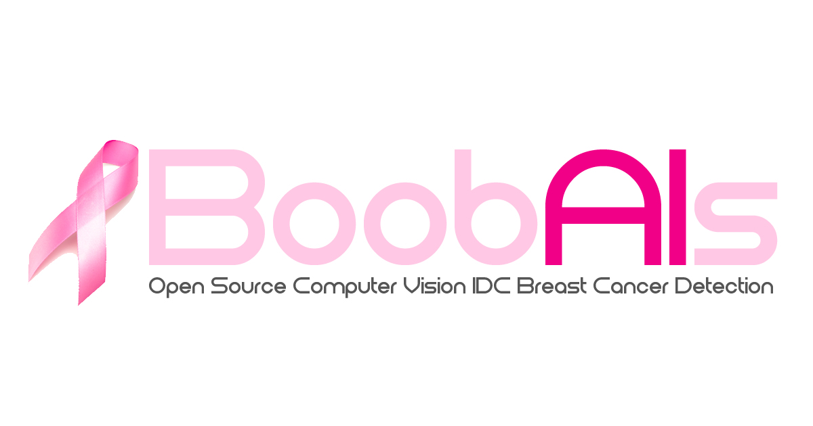

# BoobAIs: Open Source IoT Connected Computer Vision IDC Breast Cancer Detection 

## Introduction

BoobAIs is a free and open source project by  [Adam Milton-Barker](https://www.adammiltonbarker.com/ "Adam Milton-Barker"). The project combines computer vision and the Internet of Things to provide doctors, students and researchers with a way to train a neural network with labelled breast cancer histology images to detect invasive ductal carcinoma (IDC) in unseen/unlabelled images.

BoobAIs uses the power of the **Intel® Movidius** and uses a custom trained **Inception V3 model** to carry out **image classification**, both locally and on a live webcam stream. BoobAIs uses the [IoT JumpWay](https://iot.techbubbletechnologies.com "IoT JumpWay") for IoT communication and publishes messages to the broker when an object is identified.

## Applications

BoobAIs is made up of 4 core applications:

- **Trainer:** A training program that allows you to train your own convulutional neural network for computer vision using your own image.
- **Evaluator:** An evaluation program for evaluating your model. 
- **Classifier:** A classification program for testing your model on your own testing dataset. 
- **Server/API:** A server that powers a REST Api on an Intel NUC. The server recieves images sent from an Android app, process them and returns a classification. 
- **Android App:** An Android app for managing your neural network, uploading new training data and classifying images. 
