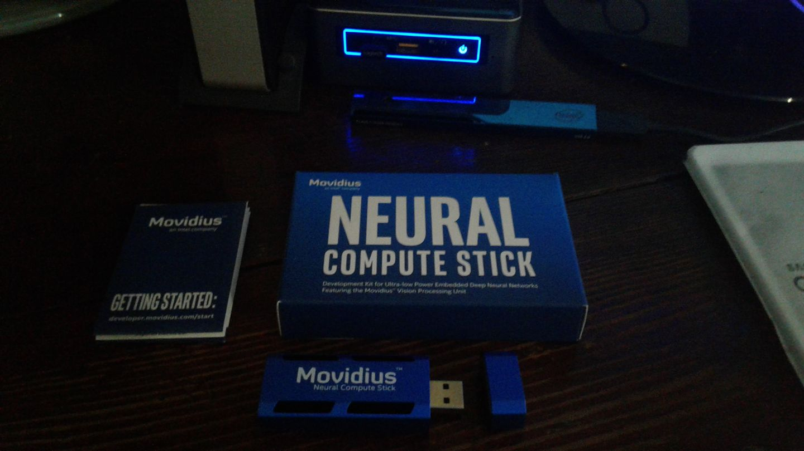

# BoobAIs: Open Source IoT Connected Computer Vision IDC Breast Cancer Detection 


## Introduction

BoobAIs is a free and open source project by  [Adam Milton-Barker](https://iot.techbubbletechnologies.com/developers/dashboard/ "Adam Milton-Barker"). the project combines computer vision and the Internet of Things to provide doctors with a way to train a neural network with labelled breast cancer histology images to detect invasive ductal carcinoma (IDC) in unseen/unlabelled images.

BoobAIs uses the power of the **Intel® Movidius** and uses a custom trained **Inception V3 model** to carry out **image classification**, both locally and on a live webcam stream. BoobAIs uses the [IoT JumpWay](https://iot.techbubbletechnologies.com "IoT JumpWay") for IoT communication and publishes messages to the broker when IDC is identified.

- **Acknowledgement:** Uses code from Intel® **movidius/ncsdk** ([movidius/ncsdk Github](https://github.com/movidius/ncsdk "movidius/ncsdk Github"))
- **Acknowledgement:** Uses code from chesterkuo **imageclassify-movidius** ([imageclassify-movidius Github](https://github.com/chesterkuo/imageclassify-movidius "imageclassify-movidius Github"))



## What Will We Do?

1. Install the [Intel® NCSDK](https://github.com/movidius/ncsdk "Intel® NCSDK")
2. Install the [IoT JumpWay MQTT Client](https://github.com/AdamMiltonBarker/JumpWayMQTT "IoT JumpWay MQTT Client") 
3. Clone & Set Up The Repo
4. Train Inception V3 IDC Recognition
5. Test Inception V3 IDC Recognition
6. Live Inception V3 IDC Recognition
6. Communication with IoT alarm via rules

## Python Versions

- Tested in Python 3.5

## Software Requirements

- [Intel® NCSDK](https://github.com/movidius/ncsdk "Intel® NCSDK") 
- [IoT JumpWay MQTT Client](https://github.com/AdamMiltonBarker/JumpWayMQTT "IoT JumpWay MQTT Client") 

## Hardware Requirements

- Linux Device For Training
- NVIDIA GPU For Training (Optional)
- Intel® Movidius
- Android Device

This tutorial can be used on a number of devices: 

- Laptop / PC running Ubuntu
- Intel® NUC running Ubuntu / Ubuntu LTS

If you are completing the full tutorial: 

- 1 x Intel® Edison
- 1x Grove starter kit plus - Intel® IoT Edition for Intel® Edison
- 1 x Blue LED (Grove)
- 1 x Red LED (Grove)
- 1 x Buzzer (Grove)

## Install NCSDK

The first thing you will need to do once you have your operating system on your device is to install the **NCSDK**.  You should use the following commands to install the NCSDK normally

```
 $ mkdir -p ~/workspace
 $ cd ~/workspace
 $ git clone https://github.com/movidius/ncsdk.git
 $ cd ~/workspace/ncsdk
 $ make install
```

Next plug your Movidius into your device and issue the following commands, this will take a while if you are installing on a Raspberry Pi 3

```
 $ cd ~/workspace/ncsdk
 $ make examples
```

## Getting Started With The IoT JumpWay

There are a few tutorials that you should follow before beginning, especially if it is the first time you have used the **IoT JumpWay Developer Program**. If you do not already have one, you will require an **IoT JumpWay Developer Program developer account**, and some basics to be set up before you can start creating your IoT devices. Visit the following [IoT JumpWay Developer Program Docs (5-10 minute read/setup)](https://github.com/TechBubbleTechnologies/IoT-JumpWay-Docs/ "IoT JumpWay Developer Program Docs (5-10 minute read/setup)") and check out the guides that take you through registration and setting up your Location Space, Zones, Devices and Applications (About 5 minutes read).

## Install IoT JumpWay MQTT Client

Next install the IoT JumpWay MQTT Client. For this you can execute the following command:

```
 $ pip3 install JumpWayMQTT 
```

## IoT JumpWay Device Connection Credentials & Settings

- Setup an IoT JumpWay Location Device for TASS, ensuring you set up you camera node,as you will need the ID of the camera for the project to work. Once your create your device, make sure you note the MQTT username and password, the device ID and device name exactly, you will also need the zone and location ID. You will need to edit your device and add the rules that will allow it to communicate autonomously with the other devices and applications on the network, but for now, these are the only steps that need doing at this point.

Follow the [IoT JumpWay Developer Program (BETA) Location Device Doc](https://github.com/TechBubbleTechnologies/IoT-JumpWay-Docs/blob/master/4-Location-Devices.md "IoT JumpWay Developer Program (BETA) Location Device Doc") to set up your devices.

```
{
    "IoTJumpWay": {
        "Location": YourLocationID,
        "Zone": YourZoneID,
        "Device": YourDeviceID,
        "App": YourAppID
    },
    "IoTJumpWayApp": {
        "Name" : "YourAppName"
    },
    "IoTJumpWayDevice": {
        "Name" : "YourDeviceName"
    },
    "IoTJumpWayMQTT": {
        "Username": "YourMQTTusername",
        "Password": "YourMQTTpassword"
    },
    "Actuators": {},
    "Cameras": [
        {
            "ID": YourCameraID,
            "URL": 0,
            "Name": "YourCameraName"
        }
    ],
    "Sensors": {},
	"IoTJumpWayMQTTSettings": {
        "MQTTUsername": "YourMQTTUsername",
        "MQTTPassword": "YourMQTTPassword"
    },
	"ClassifierSettings":{
		"dataset_dir":"model/train/",
		"log_dir":"model/_logs",
		"classes":"model/classes.txt",
		"labels":"labels.txt",
		"labels_file":"model/train/labels.txt",
		"validation_size":0.3,
		"num_shards":2,
		"random_seed":50,
		"tfrecord_filename":"200label",
		"file_pattern":"200label_%s_*.tfrecord",
		"image_size":299,
		"num_classes":2,
		"num_epochs":60,
		"batch_size":10,
		"initial_learning_rate":0.0001,
		"learning_rate_decay_factor":0.96,
		"num_epochs_before_decay":10,
        "NetworkPath":"",
        "InceptionImagePath":"model/inception/test/",
        "InceptionThreshold": 0.54,
        "InceptionGraph":"igraph"
	}
}
```

## Cloning The Repo

You will need to clone this repository to a location on your development terminal. Navigate to the directory you would like to download it to and issue the following commands.

    $ git clone https://github.com/AdamMiltonBarker/BoobAIs.git
	
Once you have the repo, you will need to find the files in this folder located in [BoobAIs/V1/Python/Tensorflow/Inception-V3](https://github.com/AdamMiltonBarker/BoobAIs/tree/master/V1/Python/Tensorflow/Inception-V3 "BoobAIs/V1/Python/Tensorflow/Inception-V3 directory").

## Preparing Your Training Data

For this tutorial, I used a dataset from Kaggle ([Predict IDC in Breast Cancer Histology Images]("https://www.kaggle.com/paultimothymooney/predict-idc-in-breast-cancer-histology-image "Predict IDC in Breast Cancer Histology Images")), but you are free to use any dataset you like. Once you decide on your dataset you need to arrange your data into the model/train directory. Each directory should be titled with integers. In my testing I used 4400 positive and 4400 negative examples giving an overall training accuracy of 0.8716 and an average confidence of 0.96 on correct identifications. The data provided is 50px x 50px. As Inception V3 was trained on images of size 299px x 299px, the images are resized to 299px x 299px, ideally the images would be that size already so you may want to try different datasets and see how your results vary. 

## Training Your Model

Once you have prepared your training data, you are ready to start training. For training I suggest using a Linux desktop or laptop, preferably with an NVIDIA GPU. To begin training, you simply need to issue the following commands (assuming BoobAIs is on your desktop):

```
$ cd ~/Desktop/BoobAIs/V1/Python/Tensorflow/Inception-V3
$ ./TassMovidiusTrainer.sh
```

The contents of TassMovidiusTrainer.sh are as follows:

```
#TASS Movidius Trainer
pip3 install -r requirements.txt
python3 TassMovidiusData.py sort
python3 TassMovidiusTrainer.py
mvNCCompile model/MovidiusInception.pb -in=input -on=InceptionV3/Predictions/Softmax
mv graph igraph
python3 TassMovidiusClassifier.py InceptionTest
```

1. Install any requirements
2. Sort our training data
3. Train the model
4. Compile the model for Movidius
5. Rename the graph file
6. Start testing

## Setting Up Your Intel® Edison IoT Alarm


The next step is to set up your Intel® Edison so that TASS can communicate with it via the IoT JumpWay. For this, I already created a tutorial for the IoT JumpWay Intel® Edison Dev Kit IoT Alarm that will guide you through this process. The only difference is that you do not need to set up the Python commands application, as in this project, TASS will replace the Python commands application, to save time, please only follow the steps for the Intel® Edison device Node JS application. 

You will find the tutorial on the following link: 

[IoT JumpWay Intel® Edison Dev Kit IoT Alarm](https://github.com/AdamMiltonBarker/IoT-JumpWay-Intel-Examples/tree/master/Intel-Edison/Dev-Kit-IoT-Alarm/NodeJS "IoT JumpWay Intel® Edison Dev Kit IoT Alarm")

Once you have completed that tutorial and have your device setup, return here to complete the final integration steps.

## Setting Up Your Rules

You are now ready to take the final steps, at this point you should have everything set up and your Intel® Edison Dev Kit IoT Alarm should be running and connected to the IoT JumpWay waiting for instructions. 

Next we are going to set up the rules that allow TASS PVL to control your Intel® Edison Dev Kit IoT Alarm autonomously. Go back to the TAS PVL device page and make sure you are on the edit page. Scroll down to below where you added the camera node and you will see you are able to add rules. 


The rules that we want to add are as follows:

1. When IDC is identified, turn on the red LED.

3. When IDC is identified, turn on the buzzer.

The events are going be triggered by warning messages sent from TASS, so in the On Event Of drop down, select WARNING. Then you need to select the camera node you added to the TASS device, as this is the sensor that the warning will come from. Next choose RECOGNISED in the With Warning Of, which will mean that the rule will be triggered when the IoT JumpWay receives a warning message that an object has been identified, then select the Send Device Command for the Take The Following Action section, choose the Intel® Edison as the device, the red LED as the sensor, toggle as the action and on as the command. This will then tell the Edison to turn on the red light in the event of an object being detected, repeat this process for the buzzer. 

## Seeing What Your Neural Network Sees

In the event that an object is detected with a confidence higher than the threshold, the frame will be saved in the **data/captures** folder, bounding boxes will be drawn around all objects that are detected.

## Viewing Your Data

When the program detects an object, it will send sensor data to the [IoT JumpWay](https://iot.techbubbletechnologies.com/ "IoT JumpWay"). You will be able to access the data in the [IoT JumpWay Developers Area](https://iot.techbubbletechnologies.com/developers/dashboard/ "IoT JumpWay Developers Area"). Once you have logged into the Developers Area, visit the [IoT JumpWay Location Devices Page](https://iot.techbubbletechnologies.com/developers/location-devices "Location Devices page"), find your device and then visit the Sensor Data pages to view the data sent from the device.


## Bugs/Issues

Please feel free to create issues for bugs and general issues you come across whilst using this or any other Intel® related IoT JumpWay issues. You may also use the issues area to ask for general help whilst using the IoT JumpWay in your IoT projects.

## Contributors

[](https://github.com/AdamMiltonBarker)

 